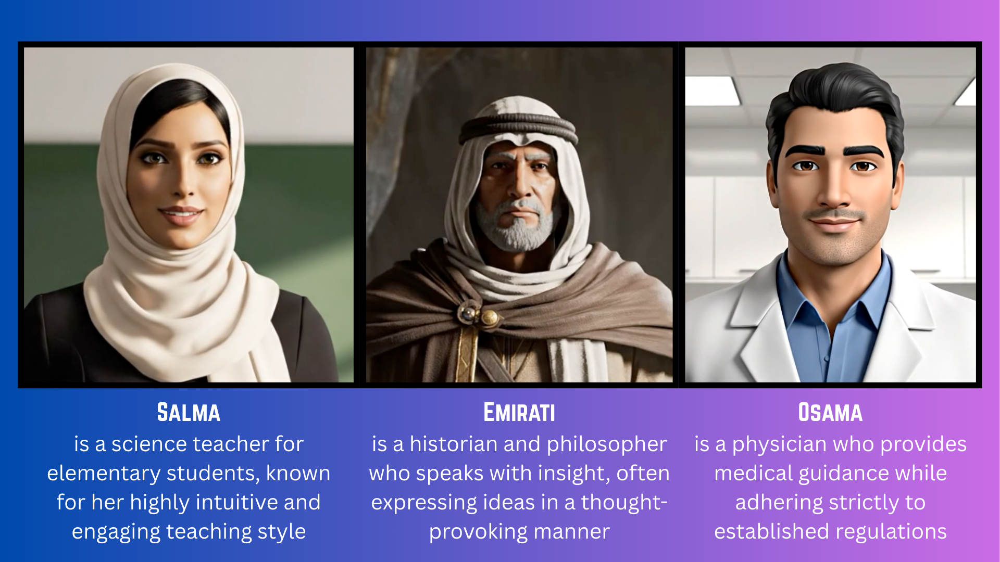

# AvatarAI Live
*Interactive Local AI Avatars with Streaming Responses*

---

## Introduction
**AvatarAI Live** allows users to select and communicate with a variety of local AI avatars. Each character has its own voice, personality, and domain expertise. Using streaming-enabled AI models, the avatars provide near real-time responses, making the interaction feel natural and engaging.

Demos for each character are shown below.

---

## Characters & Demos

Osama – Physician

<video controls autoplay loop src="https://github.com/user-attachments/assets/524f107f-2829-4515-9104-220157705aa6" muted="false" width="300"></video>

Salma – Science Teacher

<video controls autoplay loop src="assets/salma.mp4" muted="false" width="300"></video>

Emirati – Historian/Philosopher

<video controls autoplay loop src="https://github.com/Zejun-Yang/AniPortrait/assets/21038147/82c0f0b0-9c7c-4aad-bf0e-27e6098ffbe1" muted="false" width="300"></video>

---

## Tech Stack

- **Google AI Studio** – Initial avatar generation  
- **ElevenLabs** – Voice generation for each character  
- **Parakeet (Local)** – Automatic Speech Recognition (ASR)  
- **LiquidAI LFM2** (via Ollama, INT4 optimized) – Local LLM inference  
- **CosyVoice (Local)** – Text-to-Speech (TTS)  
- **GAN-based model** – Lip movement generation synced with TTS  

---

## Hardware Tested On

- **Apple M4 (MLX)**  
- **NVIDIA RTX 4070 Ti (12GB VRAM)**  

**Response Times:**  
- First chunk: ~3–5 seconds  
- Subsequent chunks processed in background  
- Performance can improve with additional hardware or distributed processing  

---

## Evaluation
Evaluation was performed subjectively by the development team, verifying avatar responses against predefined parameters. Examples include:  
- **Osama** adhering to HIPAA and other medical standards  
- Consistency of character tone and personality  
- Responsiveness and alignment of lip movement  

---

## Limitations
- Occasional slight jerks in video due to chunk stitching or delayed rendering  
- Using larger foundational LLMs could provide more curated and natural responses  

---

**Note:** This project focuses on fully local avatars; no cloud inference is required after initial setup.
